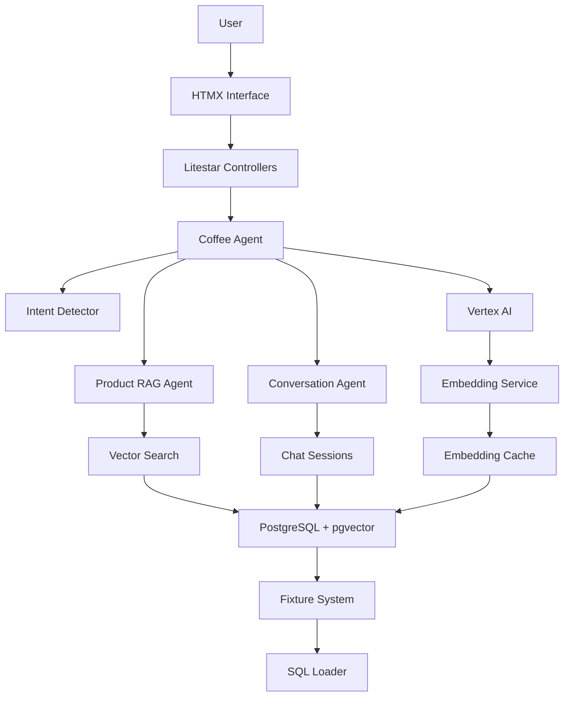

# Cymbal Coffee AI Agent Application - Architectural Overview

## Project Goals

Transform the existing Oracle-based Cymbal Coffee application into a modern AI agent-based system using:

- **Google Agent SDK (ADK)** for intelligent agent orchestration
- **PostgreSQL with pgvector** for vector search and data storage
- **SQLSpec** for clean SQL management and database operations
- **Litestar** framework for high-performance web services
- **HTMX** for reactive UI without complex JavaScript

## Core Architecture Principles

### 1. Agent-First Design

- Replace complex service orchestration with intelligent agent routing
- Use Google ADK's multi-agent system for specialized tasks
- Implement intent detection through agents, not hardcoded rules
- Enable natural conversation flow with context awareness

### 2. Clean Data Layer

- SQLSpec for SQL query management (no ORM complexity)
- Dedicated migration system with version control
- Gzipped fixture management for data portability
- Type-safe operations with msgspec DTOs

### 3. Simplified Services

- Remove unnecessary complexity (inventory, shops, companies)
- Focus on core functionality: products, chat, metrics, caching
- Use SQLSpec service patterns from reference implementations
- Implement proper separation of concerns

### 4. Modern Web Stack

- HTMX for dynamic UI with server-side rendering
- Streaming responses for real-time agent interactions
- Template-based architecture for maintainability
- Static asset management with proper caching

## High-Level Architecture

## Key Components

### Agent Layer

- **Main Coffee Agent**: Coordinates all interactions
- **Intent Detector**: Classifies queries (product vs general)
- **Product RAG Agent**: Handles product searches and recommendations
- **Conversation Agent**: Manages general coffee conversation

### Data Layer

- **PostgreSQL**: Primary database with pgvector extension
- **SQLSpec**: Query management and migration system
- **Fixture System**: Gzipped JSON data management
- **Caching**: Response and embedding caches for performance

### Service Layer

- **Agent Service**: ADK agent orchestration
- **Product Service**: Product catalog and vector search
- **Chat Service**: Conversation management
- **Cache Service**: Multi-level caching strategy
- **Metrics Service**: Performance tracking

### Web Layer

- **HTMX Templates**: Reactive UI components
- **Litestar Controllers**: HTTP request handling
- **Static Assets**: CSS, JavaScript, images
- **Streaming**: Real-time agent responses

## Technology Stack

| Layer | Technology | Purpose |
|-------|------------|---------|
| Agent | Google ADK | AI agent orchestration |
| AI/ML | Vertex AI | Embeddings and LLM |
| Database | PostgreSQL + pgvector | Vector search and storage |
| ORM/SQL | SQLSpec | Query management |
| Web | Litestar + HTMX | High-performance web framework |
| Serialization | msgspec | Fast JSON processing |
| CLI | Litestar CLI + Click | Command line interface |
| Templates | Jinja2 | Server-side rendering |

## Simplified vs Original

### Removed Components

- ❌ Oracle 23AI (replaced with PostgreSQL)
- ❌ Complex inventory management
- ❌ Shop location services
- ❌ Company management
- ❌ Intent exemplar system
- ❌ Bulk embedding operations
- ❌ Complex persona management
- ❌ Advanced dashboard features

### Enhanced Components

- ✅ AI agent-based routing (vs hardcoded logic)
- ✅ Vector search with pgvector (vs Oracle vector)
- ✅ Clean SQL management with SQLSpec
- ✅ Fixture-based data management
- ✅ Streamlined chat interface
- ✅ Type-safe DTOs with msgspec
- ✅ Modern CLI with integrated commands

## Development Phases

1. **Foundation** (Database, SQL, Fixtures)
2. **Core Services** (Products, Chat, Cache)
3. **Agent Integration** (ADK implementation)
4. **Web Interface** (Controllers, Templates)
5. **Testing & Optimization** (Performance, reliability)

## Success Metrics

- **Simplicity**: 60% reduction in codebase complexity
- **Performance**: Sub-200ms response times for product queries
- **Maintainability**: Clear separation of concerns
- **Extensibility**: Easy to add new agent capabilities
- **Developer Experience**: Comprehensive CLI tooling
