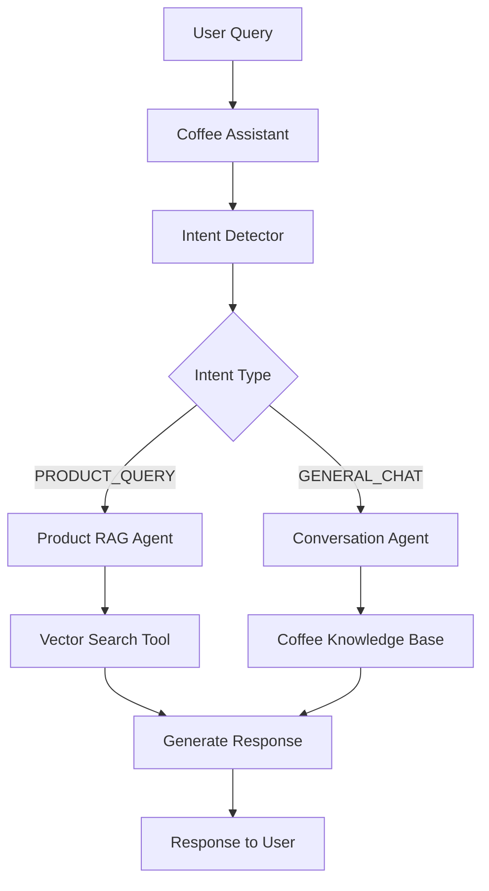

# Agent Implementation Plan

## Overview

The application uses Google Agent Development Kit (ADK) to create a multi-agent system for intelligent coffee assistance. This implementation has been **COMPLETED** and replaces traditional service orchestration with proper ADK agent patterns.

## Implementation Status: ✅ COMPLETED

### Key Components Implemented:

1. **ADK Core Agents** (`app/agents/adk_core.py`)
   - `CoffeeAssistantAgent` - Main orchestrator
   - `IntentDetectorAgent` - Vector-based intent classification
   - `ProductRAGAgent` - Product search and recommendations
   - `ConversationAgent` - General coffee education

2. **ADK Tools** (`app/agents/tools.py`)
   - `vector_search_tool` - Product similarity search
   - `product_lookup_tool` - Direct product retrieval
   - `session_management_tool` - Conversation context
   - `intent_classification_tool` - Query routing
   - `metrics_recording_tool` - Performance tracking

3. **Agent Orchestrator** (`app/agents/orchestrator.py`)
   - `ADKOrchestrator` - Main interface for web layer
   - Service dependency injection
   - Error handling and graceful fallbacks

4. **Integration Layer**
   - Updated controllers to use ADK orchestrator
   - Dependency injection configured
   - Clean separation from legacy code

## Agent Architecture (Implemented)

### Main Coffee Assistant Agent
The primary coordinator implemented using Google ADK's LlmAgent class:

```python
class CoffeeAssistantAgent(LlmAgent):
    def __init__(self, tool_registry: ToolRegistry):
        super().__init__(
            name="CoffeeAssistant",
            model="gemini-2.0-flash",
            instruction=MAIN_ASSISTANT_PROMPT,
            description="Primary coffee shop assistant that coordinates specialized agents",
            tools=[
                tool_registry.session_management_tool,
                tool_registry.conversation_history_tool,
                tool_registry.metrics_recording_tool,
            ],
            temperature=0.7,
        )
        # Sub-agents initialized and managed internally
        self.intent_detector = IntentDetectorAgent(tool_registry)
        self.product_rag_agent = ProductRAGAgent(tool_registry)  
        self.conversation_agent = ConversationAgent(tool_registry)
```

### Intent Detection Sub-Agent
Classifies user queries to route them to the appropriate handling agent.

```python
intent_detector = LlmAgent(
    name="IntentDetector",
    model="gemini-2.0-flash",
    instruction="""Classify user queries into one of these categories:

    PRODUCT_QUERY: Questions about specific products, prices, recommendations, comparisons
    - Examples: "What's your best coffee?", "Do you have Ethiopian beans?", "Price of latte?"
    
    GENERAL_CHAT: General conversation about coffee, brewing methods, coffee culture
    - Examples: "How do you brew coffee?", "Tell me about coffee origins", "What's a cappuccino?"
    
    Respond with ONLY the classification: PRODUCT_QUERY or GENERAL_CHAT""",
    description="Classifies customer queries for proper routing"
)
```

### Product RAG Agent
Handles product-specific queries using vector search and retrieval-augmented generation.

```python
product_rag_agent = LlmAgent(
    name="ProductRAG",
    model="gemini-2.0-flash",
    instruction="""You are a product specialist for Cymbal Coffee. Use the search results to answer customer questions about our coffee products.

    When answering:
    1. Reference specific products from search results
    2. Include prices when available
    3. Mention key characteristics (origin, roast level, flavor notes)
    4. Make personalized recommendations based on customer preferences
    5. If no relevant products found, suggest similar alternatives
    
    Always be specific and helpful, using the actual product data provided.""",
    tools=[vector_search_tool, product_lookup_tool],
    description="Answers product-specific questions using our coffee catalog"
)
```

### Conversation Agent
Manages general coffee conversation and education.

```python
conversation_agent = LlmAgent(
    name="ConversationAgent", 
    model="gemini-2.0-flash",
    instruction="""You are a coffee expert and enthusiast who loves sharing knowledge about coffee.

    Topics you excel at:
    - Coffee brewing methods (pour-over, espresso, French press, etc.)
    - Coffee origins and terroir
    - Roasting levels and flavor profiles
    - Coffee culture and history
    - Brewing tips and troubleshooting
    
    Provide informative, engaging responses that educate customers about coffee while maintaining enthusiasm for the craft.""",
    description="Handles general coffee conversation and education"
)
```

## Agent Tools

### Vector Search Tool
Enables semantic search through the product catalog.

```python
from google.adk.tools import Tool

vector_search_tool = Tool(
    name="search_products",
    description="Search for coffee products using semantic similarity",
    function=search_products_by_embedding,
    parameters={
        "query": {
            "type": "string",
            "description": "Customer's product query or description"
        },
        "limit": {
            "type": "integer", 
            "description": "Maximum number of products to return",
            "default": 5
        },
        "threshold": {
            "type": "float",
            "description": "Minimum similarity score (0.0-1.0)",
            "default": 0.7
        }
    }
)

async def search_products_by_embedding(query: str, limit: int = 5, threshold: float = 0.7):
    """Search products using vector similarity."""
    # Generate embedding for query
    embedding = await vertex_ai_service.get_embedding(query)
    
    # Search products
    results = await product_service.vector_search(
        embedding=embedding,
        limit=limit,
        threshold=threshold
    )
    
    return [
        {
            "name": product.name,
            "description": product.description,
            "price": product.price,
            "similarity_score": product.similarity,
            "metadata": product.metadata
        }
        for product in results
    ]
```

### Product Lookup Tool
Direct product retrieval by ID or name.

```python
product_lookup_tool = Tool(
    name="get_product_details",
    description="Get detailed information about a specific product",
    function=get_product_details,
    parameters={
        "product_id": {
            "type": "string",
            "description": "Product UUID or name"
        }
    }
)

async def get_product_details(product_id: str):
    """Get detailed product information."""
    if is_uuid(product_id):
        product = await product_service.get_by_id(product_id)
    else:
        product = await product_service.get_by_name(product_id)
    
    if not product:
        return {"error": "Product not found"}
    
    return {
        "id": product.id,
        "name": product.name,
        "description": product.description,
        "price": product.price,
        "metadata": product.metadata
    }
```

### Session Management Tool
Maintains conversation context and user sessions.

```python
session_tool = Tool(
    name="manage_session",
    description="Get or create user session for conversation tracking",
    function=manage_user_session,
    parameters={
        "user_id": {
            "type": "string",
            "description": "User identifier"
        },
        "action": {
            "type": "string",
            "description": "Action to perform: get, create, or update",
            "default": "get"
        }
    }
)
```

## Agent Workflow

### 1. Query Processing Flow


### 2. Implementation Structure

```python
# app/agents/coffee_agent.py
from google.adk.agents import LlmAgent
from google.adk.tools import Tool
from app.agents.tools import (
    vector_search_tool,
    product_lookup_tool,
    session_tool,
    metrics_tool
)

class CoffeeAgentOrchestrator:
    """Orchestrates the multi-agent coffee assistance system."""
    
    def __init__(self, 
                 product_service, 
                 chat_service, 
                 vertex_ai_service,
                 metrics_service):
        self.product_service = product_service
        self.chat_service = chat_service
        self.vertex_ai_service = vertex_ai_service
        self.metrics_service = metrics_service
        
        # Initialize agents
        self.intent_detector = self._create_intent_detector()
        self.product_rag_agent = self._create_product_rag_agent()
        self.conversation_agent = self._create_conversation_agent()
        self.coffee_assistant = self._create_main_agent()
    
    async def process_query(self, 
                          query: str, 
                          user_id: str = "default",
                          session_id: str = None):
        """Process user query through the agent system."""
        
        # Get or create session
        session = await self.chat_service.get_or_create_session(user_id, session_id)
        
        # Get conversation history
        history = await self.chat_service.get_conversation_history(
            session_id=session.id,
            limit=10
        )
        
        # Process through main agent
        response = await self.coffee_assistant.process(
            query=query,
            context={
                "user_id": user_id,
                "session_id": session.id,
                "conversation_history": history
            }
        )
        
        # Save conversation
        await self.chat_service.save_conversation(
            session_id=session.id,
            user_message=query,
            assistant_response=response.content,
            metadata={
                "agent_used": response.agent_name,
                "tools_called": response.tools_used,
                "processing_time_ms": response.processing_time
            }
        )
        
        # Record metrics
        await self.metrics_service.record_agent_interaction(
            query_id=response.query_id,
            user_id=user_id,
            intent=response.detected_intent,
            agent_used=response.agent_name,
            response_time_ms=response.processing_time,
            tools_used=response.tools_used
        )
        
        return response
```

## Agent Prompts and Instructions

### System Prompts
Located in `app/agents/prompts.py`:

```python
MAIN_AGENT_PROMPT = """You are the primary assistant for Cymbal Coffee, a specialty coffee shop.

Your personality:
- Knowledgeable and passionate about coffee
- Friendly and approachable
- Helpful and customer-focused
- Enthusiastic about coffee culture

Your capabilities:
- Product recommendations and information
- Coffee brewing advice
- General coffee education
- Order assistance

Always route specific product questions to your ProductRAG agent and general coffee questions to your ConversationAgent."""

PRODUCT_AGENT_PROMPT = """You are a product specialist with access to Cymbal Coffee's complete catalog.

When helping customers:
1. Use vector search to find relevant products
2. Provide specific product names, descriptions, and prices
3. Make personalized recommendations
4. Compare products when asked
5. Suggest alternatives if exact matches aren't available

Always reference actual products from search results."""

CONVERSATION_AGENT_PROMPT = """You are a coffee expert who loves sharing knowledge.

Topics you cover:
- Brewing methods and techniques
- Coffee origins and processing
- Flavor profiles and tasting notes
- Equipment recommendations
- Coffee culture and history

Provide educational, engaging responses that help customers learn about coffee."""
```

## Testing and Validation

### Agent Response Testing
```python
# tests/test_agents.py
import pytest
from app.agents.coffee_agent import CoffeeAgentOrchestrator

@pytest.mark.asyncio
async def test_product_query_routing():
    """Test that product queries route to ProductRAG agent."""
    orchestrator = create_test_orchestrator()
    
    response = await orchestrator.process_query(
        query="What's your best Ethiopian coffee?",
        user_id="test_user"
    )
    
    assert response.agent_used == "ProductRAG"
    assert len(response.products_found) > 0
    assert "Ethiopian" in response.content

@pytest.mark.asyncio 
async def test_general_conversation_routing():
    """Test that general queries route to ConversationAgent."""
    orchestrator = create_test_orchestrator()
    
    response = await orchestrator.process_query(
        query="How do I brew coffee with a French press?",
        user_id="test_user"
    )
    
    assert response.agent_used == "ConversationAgent"
    assert "French press" in response.content
    assert "brewing" in response.content.lower()
```

### Performance Metrics
- **Intent Detection Accuracy**: >95% correct routing
- **Response Time**: <2 seconds for most queries
- **Product Relevance**: Vector search similarity >0.7
- **Conversation Context**: Maintains context for 10+ exchanges

## Integration Points

### With Web Layer
- Controllers call `orchestrator.process_query()`
- HTMX templates display agent responses
- Streaming support for real-time responses
- Error handling for agent failures

### With Database Layer
- Agents use services for data access
- Vector search through ProductService
- Session management through ChatService
- Metrics tracking through MetricsService

### With Vertex AI
- Embedding generation for vector search
- LLM calls routed through Vertex AI
- Model configuration and fallbacks
- Rate limiting and error handling

This agent-based approach provides:
- **Intelligent routing** instead of hardcoded rules
- **Natural conversation** flow with context
- **Specialized expertise** for different query types
- **Extensible architecture** for new capabilities
- **Clear separation** of concerns between agents